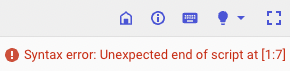

# biggquery_console_supporter

BigQuery のコンソールを使いやすくする Chrome 拡張機能
機能は順次追加を検討中

# 機能

## バリデーションメッセージのコピー

BigQuery の Web コンソールのエディタに表示されるクエリのバリデーションメッセージをコピーするには、テキストをドラッグしなければならない。
しかしウィンドウ幅が狭くテキストの一部しか表示されないなど、ドラッグができないこともある。
この拡張機能を導入すれば、バリデーションメッセージや隣のアイコンをクリックするだけでコピーが完了する。

